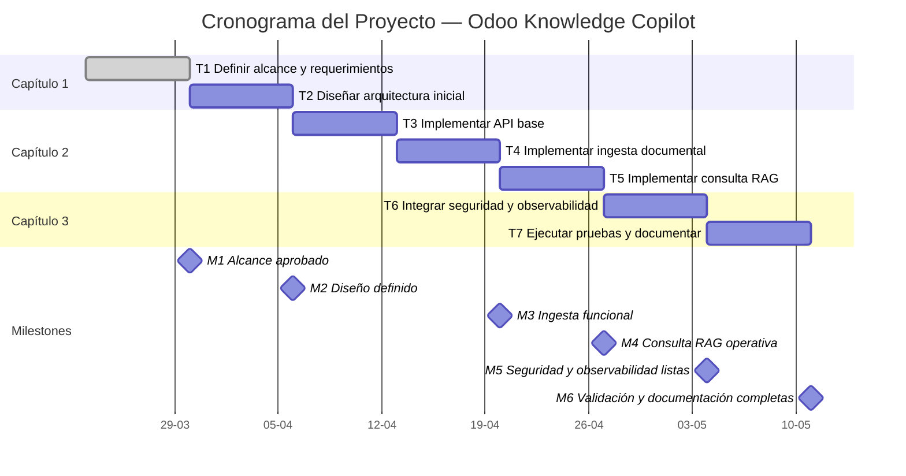

# Odoo Knowledge Copilot
## Entregable 1 — Alcance, Requerimientos y Plan de Trabajo

**Proyecto:** Asistente AI/LLM con RAG para soporte funcional y técnico de Odoo  
**Autor:** Hector Fidel Cruz Rodriguez  
**Versión:** 1.0 
**Fecha:** 2026-03-20  

---

# 1. Documento de Alcance del Proyecto

## 1.1 Problema empresarial

En entornos empresariales que utilizan Odoo, el conocimiento funcional y técnico suele estar distribuido entre manuales, procedimientos internos, tickets resueltos, documentación técnica, configuraciones por cliente y notas operativas. Esta dispersión obliga a los equipos a invertir tiempo excesivo en buscar información, genera dependencia de personas clave, dificulta el onboarding y produce respuestas inconsistentes ante consultas recurrentes.

Desde la perspectiva de negocio, esta situación incrementa tiempos de atención, eleva costos operativos y reduce la capacidad de respuesta de los equipos funcionales y técnicos. En consecuencia, existe una oportunidad clara para implementar una solución AI/LLM que centralice el acceso al conocimiento documental y permita consultar información relevante de forma más rápida, trazable y consistente.

## 1.2 Caso de uso AI/LLM seleccionado

Se propone desarrollar un asistente AI/LLM basado en arquitectura **RAG (Retrieval-Augmented Generation)** para soporte funcional y técnico de Odoo. La solución permitirá ingerir documentos, indexarlos semánticamente y responder consultas en lenguaje natural utilizando contexto recuperado desde una base documental curada, incorporando además referencias a las fuentes utilizadas.

El caso de uso está enfocado en consultas de soporte, revisión de procedimientos, validación de configuraciones y acceso rápido a conocimiento operativo, sin ejecutar acciones transaccionales dentro del ERP.

## 1.3 Definición precisa del caso de uso empresarial (5W+H)

### What
Se propone una solución AI/LLM basada en arquitectura RAG para consultar documentación funcional, técnica y operativa de Odoo mediante lenguaje natural. El sistema permitirá ingerir documentos, indexarlos semánticamente y responder preguntas utilizando contexto recuperado, incorporando referencias a las fuentes utilizadas.

### Why
La información de Odoo suele estar dispersa en múltiples fuentes documentales, lo que provoca demoras en la búsqueda, dependencia de expertos, respuestas inconsistentes y fricción operativa. La solución busca reducir el tiempo de búsqueda y resolución de consultas, mejorar la trazabilidad de las respuestas y acelerar las actividades de soporte y onboarding.

### Who
Los usuarios objetivo son:
- Consultores funcionales Odoo
- Desarrolladores Odoo
- Equipo de soporte interno
- Nuevos integrantes en proceso de onboarding
- Líder técnico o coordinador de soporte

### Where
La solución será desplegada como una API REST en un entorno ejecutable con contenedores, accesible para pruebas y demostración. El sistema operará inicialmente sobre un conjunto curado de documentos representativos del dominio funcional y técnico de Odoo.

### When
Será utilizada en escenarios como:
- Resolución de dudas funcionales frecuentes
- Consulta de configuraciones y flujos de negocio
- Soporte técnico de primer nivel
- Revisión rápida de procedimientos
- Onboarding de personal nuevo

### How
El sistema operará de la siguiente forma:
1. Se ingieren documentos PDF o Markdown.
2. Se realiza segmentación del contenido en fragmentos.
3. Se generan embeddings para los fragmentos.
4. Los embeddings se almacenan en un vector store.
5. El usuario envía una consulta en lenguaje natural.
6. El sistema recupera los fragmentos más relevantes.
7. El LLM genera una respuesta contextualizada a partir del contexto recuperado.
8. La API devuelve la respuesta junto con fuentes y metadatos.

## 1.4 Objetivo de negocio

Reducir el tiempo de búsqueda y resolución de consultas funcionales y técnicas sobre Odoo, mejorando la consistencia de las respuestas y disminuyendo la dependencia de conocimiento tácito dentro del equipo.

## 1.5 Criterio de éxito del proyecto

El proyecto será considerado exitoso si permite ingerir documentación seleccionada, responder consultas en lenguaje natural con fuentes asociadas y operar de forma estable en un entorno desplegado de demostración, cumpliendo además con los requerimientos funcionales, no funcionales y de planificación definidos para el curso.

## 1.6 Tabla IN SCOPE / OUT OF SCOPE

| IN SCOPE | OUT OF SCOPE |
|---|---|
| API REST con endpoints `/v1/query`, `/v1/ingest` y `/v1/health` | Escritura automática dentro de Odoo |
| Ingesta de documentos PDF y/o Markdown | Creación o aprobación de transacciones ERP |
| Chunking, embeddings e indexación en vector store | Fine-tuning del modelo base |
| Búsqueda semántica y recuperación de contexto | Arquitectura multiagente |
| Respuestas generadas con LLM usando contexto recuperado | Integración con WhatsApp, Telegram o Slack |
| Inclusión de fuentes o referencias documentales | OCR avanzado para documentos escaneados complejos |
| Autenticación básica por API key | Multimodalidad |
| Rate limiting básico | RBAC empresarial completo |
| Logging estructurado y health checks | Integración productiva con clientes reales |
| Ejecución mediante Docker y Docker Compose | Automatización de flujos de negocio complejos |

## 1.7 Requerimientos funcionales (RF)

| ID | Requerimiento funcional | Criterio de aceptación medible |
|---|---|---|
| RF-001 | El sistema debe permitir la ingesta de documentos PDF y/o Markdown mediante un endpoint REST. | Dado un archivo válido, al enviarlo al endpoint de ingesta, el sistema lo procesa, lo segmenta y lo indexa exitosamente. |
| RF-002 | El sistema debe permitir consultas en lenguaje natural en español. | Dada una consulta válida, el endpoint de consulta retorna una respuesta en texto sin error de servidor. |
| RF-003 | El sistema debe recuperar fragmentos relevantes antes de generar la respuesta final. | Ante una consulta, el sistema utiliza al menos top-k fragmentos recuperados del índice semántico. |
| RF-004 | El sistema debe generar respuestas contextualizadas usando un modelo LLM. | La respuesta entregada se basa en el contexto recuperado y es coherente con la pregunta formulada. |
| RF-005 | El sistema debe incluir referencias a las fuentes utilizadas. | Cada respuesta exitosa contiene al menos una referencia documental visible o metadato de origen. |
| RF-006 | El sistema debe exponer un endpoint de salud del servicio. | El endpoint `/v1/health` responde con estado HTTP 200 y estado general del sistema. |
| RF-007 | El sistema debe exigir autenticación en los endpoints protegidos. | Solicitudes sin API key válida a `/query` o `/ingest` retornan HTTP 401. |
| RF-008 | El sistema debe manejar errores de validación, autenticación e internos con códigos HTTP adecuados. | Entradas inválidas devuelven códigos 4xx y fallos internos devuelven 5xx controlado. |
| RF-009 | El sistema debe registrar eventos básicos de ejecución por solicitud. | Cada request genera logs con timestamp, endpoint, estado y latencia. |
| RF-010 | El sistema debe poder ejecutarse completamente en contenedores. | La aplicación levanta correctamente mediante Docker Compose sin cambios manuales en código. |

## 1.8 Requerimientos no funcionales (RNF)

| ID | Requerimiento no funcional | Umbral cuantificado |
|---|---|---|
| RNF-001 | Rendimiento de consulta | Latencia promedio menor a 5 segundos por consulta en ambiente de demo |
| RNF-002 | Disponibilidad en demo | 100% de disponibilidad durante la ventana de evaluación |
| RNF-003 | Seguridad de credenciales | 0 secretos hardcodeados en repositorio |
| RNF-004 | Autenticación | 100% de endpoints protegidos, excepto `/health` |
| RNF-005 | Protección ante abuso | Rate limiting activo con umbral configurable, por ejemplo 30 requests/min por API key |
| RNF-006 | Observabilidad | 100% de requests con logs estructurados mínimos |
| RNF-007 | Portabilidad | Despliegue reproducible con Docker Compose |
| RNF-008 | Calidad | Pruebas funcionales mínimas para `/health`, `/ingest` y `/query` |
| RNF-009 | Trazabilidad | 95% o más de respuestas con fuente asociada |
| RNF-010 | Mantenibilidad | Código organizado por módulos: API, seguridad, RAG, servicios y pruebas |

---

# 2. Lista de Requerimientos Técnicos y Funcionales

## 2.1 Tabla priorizada de RF y RNF

**Priorización usada:** MoSCoW

| ID | Tipo | Prioridad | Descripción sin ambigüedad | Criterio de aceptación | Objetivo de negocio asociado |
|---|---|---|---|---|---|
| RF-001 | Funcional | Must | Permitir ingesta de documentos PDF y/o Markdown vía API REST. | Documento válido queda indexado correctamente. | Centralizar conocimiento documental |
| RF-002 | Funcional | Must | Permitir consultas en lenguaje natural en español. | La consulta retorna respuesta válida. | Reducir tiempo de búsqueda |
| RF-003 | Funcional | Must | Recuperar fragmentos relevantes antes de generar la respuesta. | Se usa top-k contexto recuperado. | Mejorar precisión y consistencia |
| RF-004 | Funcional | Must | Generar respuestas contextualizadas con LLM. | Respuesta coherente con consulta y contexto. | Resolver dudas funcionales y técnicas |
| RF-005 | Funcional | Must | Devolver referencias documentales en la respuesta. | La respuesta incluye al menos una fuente. | Aumentar confianza y trazabilidad |
| RF-006 | Funcional | Must | Exponer endpoint de salud del servicio. | `/health` responde HTTP 200 correctamente. | Asegurar operatividad |
| RF-007 | Funcional | Must | Exigir autenticación por API key. | Requests no autenticados retornan HTTP 401. | Proteger acceso al sistema |
| RF-008 | Funcional | Must | Manejar errores con códigos HTTP consistentes. | Retorna 4xx o 5xx según el caso. | Mejorar robustez operativa |
| RF-009 | Funcional | Should | Registrar eventos de ejecución por solicitud. | Cada request deja traza en logs. | Soporte y diagnóstico |
| RF-010 | Funcional | Must | Ejecutarse completamente en contenedores. | El sistema levanta con Docker Compose. | Portabilidad y despliegue |
| RNF-001 | No funcional | Must | Mantener latencia promedio de consulta menor a 5 segundos. | Promedio medido en pruebas controladas. | Agilizar soporte |
| RNF-002 | No funcional | Must | Mantener disponibilidad operativa durante demo. | Servicio estable en evaluación. | Asegurar continuidad |
| RNF-003 | No funcional | Must | No exponer secretos en repositorio. | Cero secretos versionados. | Seguridad básica |
| RNF-004 | No funcional | Must | Proteger endpoints con autenticación. | 100% de endpoints protegidos salvo `/health`. | Seguridad de acceso |
| RNF-005 | No funcional | Must | Aplicar rate limiting básico. | Límite efectivo por API key. | Reducir abuso y sobrecarga |
| RNF-006 | No funcional | Must | Registrar logs estructurados por request. | 100% de requests registrados. | Observabilidad |
| RNF-007 | No funcional | Must | Ejecutarse de forma reproducible con contenedores. | Deploy repetible exitoso. | Portabilidad |
| RNF-008 | No funcional | Should | Organizar el código por módulos separados. | Estructura clara del repositorio. | Mantenibilidad |
| RNF-009 | No funcional | Must | Incluir pruebas funcionales mínimas. | Tests para `/health`, `/ingest` y `/query`. | Calidad técnica |
| RNF-010 | No funcional | Should | Permitir sustituir LLM o vector store con cambios mínimos. | Configuración desacoplada. | Evolución futura |

## 2.2 Requerimientos técnicos iniciales

| ID | Tipo | Prioridad | Descripción | Criterio de aceptación | Objetivo de negocio asociado |
|---|---|---|---|---|---|
| RT-001 | Técnico | Must | Backend en Python con FastAPI. | API operativa con endpoints definidos. | Implementación rápida y mantenible |
| RT-002 | Técnico | Must | Vector store para embeddings y búsqueda semántica. | Índice semántico funcional. | Recuperación eficiente de conocimiento |
| RT-003 | Técnico | Must | Servicio de embeddings para indexación y consulta. | Embeddings generados e insertados correctamente. | Soporte a RAG |
| RT-004 | Técnico | Must | Integración con un modelo LLM para generación. | Respuestas generadas desde contexto recuperado. | Resolver consultas en lenguaje natural |
| RT-005 | Técnico | Must | Dockerfile y docker-compose para ejecución. | Proyecto levanta con contenedores. | Portabilidad |
| RT-006 | Técnico | Must | API key en headers para autenticación. | Validación efectiva de credenciales. | Seguridad básica |
| RT-007 | Técnico | Should | Logging estructurado en JSON. | Logs legibles y útiles para debugging. | Observabilidad |
| RT-008 | Técnico | Should | Suite mínima de pruebas funcionales. | Tests ejecutables sin error crítico. | Calidad |
| RT-009 | Técnico | Could | Configuración desacoplada por variables de entorno. | Cambios de proveedor sin tocar la lógica core. | Flexibilidad |

---

# 3. Plan de Trabajo + Cronograma

## 3.1 WBS con entregables por semana

| Semana | Entregable principal | Actividades |
|---|---|---|
| Semana 1 | Análisis y alcance | Definición del caso de uso, 5W+H, alcance, RF/RNF y priorización |
| Semana 2 | Diseño inicial | Arquitectura de alto nivel, stack tecnológico, flujo funcional y estructura base |
| Semana 3 | API base | Implementación de FastAPI, configuración inicial y endpoint `/health` |
| Semana 4 | Ingesta documental | Endpoint `/ingest`, parsing, chunking, embeddings e indexación |
| Semana 5 | Consulta RAG | Endpoint `/query`, retrieval, prompt building y generación con LLM |
| Semana 6 | Seguridad y observabilidad | API key, rate limiting, logging y manejo de errores |
| Semana 7 | Validación y cierre | Pruebas funcionales, ajuste de latencia, validación de respuestas y documentación final |

## 3.2 Cronograma Gantt con milestones y dependencias

### 3.2.1 Tabla de cronograma

| ID | Actividad | Inicio | Fin | Dependencia | Milestone |
|---|---|---|---|---|---|
| T1 | Definir alcance y requerimientos | Sem 1 | Sem 1 | - | M1 |
| T2 | Diseñar arquitectura inicial | Sem 2 | Sem 2 | T1 | M2 |
| T3 | Implementar API base | Sem 3 | Sem 3 | T2 | - |
| T4 | Implementar ingesta documental | Sem 4 | Sem 4 | T3 | M3 |
| T5 | Implementar consulta RAG | Sem 5 | Sem 5 | T4 | M4 |
| T6 | Integrar seguridad y logging | Sem 6 | Sem 6 | T5 | M5 |
| T7 | Ejecutar pruebas y documentar | Sem 7 | Sem 7 | T6 | M6 |

### 3.2.2 Gantt visual (Mermaid)

### Milestones
- **M1:** Alcance y requerimientos aprobados
- **M2:** Diseño inicial definido
- **M3:** Ingesta funcional
- **M4:** Consulta RAG operativa
- **M5:** Seguridad y observabilidad listas
- **M6:** Validación y documentación completadas

## 3.3 Asignación de roles y horas

| Rol | Responsabilidad | Horas estimadas |
|---|---|---:|
| Líder técnico / Arquitecto | Alcance, arquitectura, decisiones técnicas y revisión integral | 16 |
| Desarrollador backend/IA | API, RAG, integración LLM, seguridad y pruebas | 44 |
| QA / Validación funcional | Casos de prueba, validación de respuestas y revisión de criterios | 12 |
| Documentación técnica | Elaboración de entregables, README y evidencias | 8 |

**Total estimado:** 80 horas

## 3.4 Estimación de costo operacional mensual

**Supuestos del MVP**
- 1 ambiente pequeño de despliegue
- 1 proveedor de LLM por API
- 1 vector store liviano o autogestionado
- Bajo volumen de uso de prueba

| Concepto | Estimación mensual USD |
|---|---:|
| Hosting contenedor/API | 15 |
| Vector store / base semántica | 10 |
| Consumo LLM y embeddings | 20 |
| Logs y monitoreo básico | 5 |
| Almacenamiento documental | 5 |
| Contingencia | 10 |

**Costo operacional mensual estimado:** **65 USD/mes**

## 3.5 Selección inicial de tecnologías con justificación

| Capa | Tecnología inicial | Justificación |
|---|---|---|
| Backend API | FastAPI | Ligero, rápido y adecuado para APIs modernas en Python |
| Lenguaje | Python | Ecosistema sólido para IA, embeddings, RAG y testing |
| LLM | GPT-4o-mini o equivalente | Buen balance entre costo, velocidad y calidad para MVP |
| Embeddings | Modelo de embeddings por API | Simplifica la implementación inicial |
| Vector store | Qdrant o pgvector | Adecuado para búsqueda semántica y fácil integración |
| Contenedores | Docker + Docker Compose | Portabilidad y despliegue reproducible |
| Testing | Pytest | Estándar simple y efectivo para pruebas funcionales |
| Seguridad | API key + rate limiting | Cumple el mínimo de seguridad del proyecto |
| Observabilidad | Logging JSON | Facilita trazabilidad y análisis de errores |

## 3.6 Justificación general de la solución elegida

La selección tecnológica prioriza rapidez de implementación, claridad arquitectónica, facilidad de despliegue y alineación con un MVP académico-profesional. El proyecto evita complejidad innecesaria, como multiagentes o automatización transaccional dentro de Odoo, y se concentra en resolver un problema de negocio concreto con una arquitectura defendible, mantenible y extensible.

---

# 4. Conclusión

El presente entregable establece los cimientos del proyecto al definir con claridad el problema empresarial, el caso de uso AI/LLM seleccionado, el alcance del sistema, los requerimientos funcionales y no funcionales, y el plan de trabajo para el resto del curso. La propuesta se orienta a construir un MVP viable, acotado y alineado con una necesidad real de soporte funcional y técnico en entornos Odoo, sirviendo como base para las siguientes etapas de diseño, implementación y validación.
